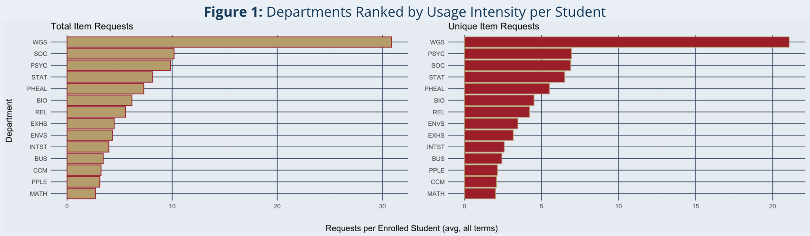
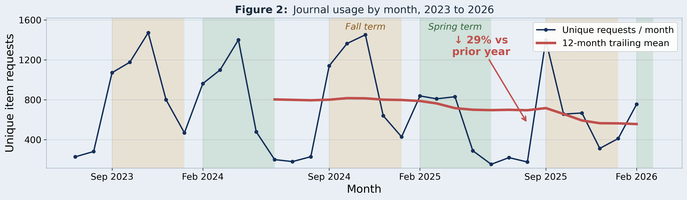

## The one-liner

> We integrated **seven COUNTER journal usage reports across five publisher
platforms and three years of university enrollment data** into **one relational
> dataset** so that **Willamette University's librarians** can **see which
> e-resources each department actually uses and decide what to renew or retire
> without disproportionately cutting small departments.**

**Role:** I built the monthly usage time series that anchors our findings, including the term-level seasonality view and the year-over-year decline figure.\
**Team:** Emily Strickland, [Sophia Rabbanian](https://github.com/sophiarabb), Tiffany Truong\
**Repo:** [github.com/sophiarabb/data510-libraries](https://github.com/sophiarabb/data510-libraries)

## The question

Willamette runs three libraries that share one collection of electronic
resources, bought from publishers in packages. As the university changes and
budgets tighten, librarians have to decide which packages to keep and which to
let go, and until now they had no way to look at how those resources were
actually being used.

That gap has a fairness problem built into it. Cutting on gut feel tends to hurt
small departments first, because low raw usage and low enrollment look identical
in a spreadsheet. We asked two questions:

1. What are the patterns in e-resource usage across subject matter, department,
   and academic term?
2. Can those patterns support defensible suggestions about which resources to
   prioritize and which to review?

The librarians make the final call. Our job was to give them evidence instead of
instinct.

## The data

Our library contact supplied seven COUNTER TR_J1 usage reports covering five
publisher platforms: Oxford (via Scholarly iQ), Springer Nature, Sage (via
Atypon), Taylor & Francis, and University of Chicago (via Atypon). Together they
hold roughly 5,400 journal-level rows of monthly usage spanning July 2023 through
March 2026. Enrollment came from Willamette's public Fact Books, about 50 majors
broken out by grade level across six terms, which we scraped from HTML into CSV.

Three things made this harder than the row count suggests:

**Nothing in the usage data says what a journal is about.** There is no subject,
department, course, or user field anywhere in a COUNTER report. Every subject
assignment in this project is a crosswalk we built by hand, journal by journal,
using the university's journal search and department list, then sent back to our
library contact to review. The crosswalk is a versioned file in `data/reference/`
so the mapping stays transparent and correctable.

**The reporting standard changed mid-window.** Oxford and Springer both migrated
from COUNTER 5.0 to 5.1 in 2025, which arrives as split files with overlapping
months (Oxford repeats January and February 2025, Springer repeats January
through March). The header row also moves between releases, so the reader locates
the row starting with `Title` rather than skipping a fixed count. We picked one
file as source of truth for each overlapping month after confirming the two
agreed, and recomputed every period total from monthly values rather than
trusting the reported total, which would have double counted.

**Identifiers are inconsistent across publishers.** Several ID columns are
populated for some platforms and blank for others, so Online ISSN is the join key
throughout, with title as fallback.

Raw exports are never edited by hand. All cleaning happens in code, so the
processed table rebuilds from the originals in one pipeline run.

## The approach

The stakeholder question is descriptive (which resources are used, by whom, and
how does that change over time), so the analysis is exploratory and descriptive
statistics rather than predictive modeling.

Two choices are worth calling out. We measure usage with **COUNTER Unique Item
Requests, not Total Item Requests**, because Total counts repeated views of the
same article and inflates differently across publisher platforms, which makes
cross-publisher comparison unfair. And we group journals into **five publisher
packages**, because the library subscribes at package level rather than by
individual title, so that is the unit an actual decision gets made on.

Cleaning and reshaping is Python (pandas, openpyxl) in VS Code, with a reusable
reader rather than seven hand-cleaned files. The tidied tables land in Beekeeper
under a designed schema (`requests`, `journal`, `publisher`, `department`, and a
`year_term` junction table) so usage can be sliced by term or by year without
reshaping again.

**Validation.** There is no ground truth for "correct" usage, so validation
focused on integrity and on whether findings survive alternative reasonable
choices. Usage records were checked for completeness before analysis, and results
are reported against the number of journals actually included, so a gap in
reporting cannot be mistaken for a change in usage. Where a result depended on a
cutoff, we tested several cutoffs and report it only where the conclusion holds
across them. Collection-wide patterns were re-checked inside each publisher and
each department separately, so a finding is reported only when it shows up
consistently rather than in a single source.

## Findings

{fig-alt="Two horizontal bar charts ranking Willamette departments by journal requests per enrolled student, one for total item requests and one for unique item requests, with Women's and Gender Studies far ahead of all others in both"}

**Usage does not track enrollment.** Women's & Gender Studies is a dramatic
outlier: an average enrollment of 3.88 students against 957 requests for
WGS-related journals. The next most usage-intense departments are much larger
ones, Psychology, Sociology, and Statistics, at roughly 7 to 8 requests per
enrolled student. Journals are clearly not used only by people majoring in the
subject, which is precisely why raw usage is a poor proxy for value to a
department.

{fig-alt="Line chart of unique item requests per month with a twelve-month trailing mean, peaking mid-term and dropping to near zero over breaks" width="90%"}

**Usage follows the academic calendar, and the whole collection is declining.**
Across the 1,493 journals reported in every month, usage peaks mid-term and drops
to near zero over breaks, with Fall showing the most consistent high-usage
pattern. Collection-wide usage fell 29% in the most recent year, from 787 to 556
unique requests per month. The decline shows up across every publisher, so it
reflects real behavior rather than a reporting gap. The isolated September 2025
spike is one newly activated journal, not a recovery.

**The caveat.** Requests come from everyone in the Willamette community, not just
enrolled students, so per-student figures carry real error, and out-of-major
requests inflate departments whose subject is broadly interesting. Many journals
do not fit cleanly into one department and were coded to their strongest-fit
category. These are suggestions for librarians who hold the domain knowledge, not
a decision rule.

## The full write-up

The written report is in progress and will be published here.

[Repository and pipeline](https://github.com/sophiarabb/data510-libraries){.btn .btn-primary}

## Dig deeper

- 📦 **Code & pipeline:** [data510-libraries](https://github.com/sophiarabb/data510-libraries)
- 📊 **Poster:** link will be here once the poster is finished